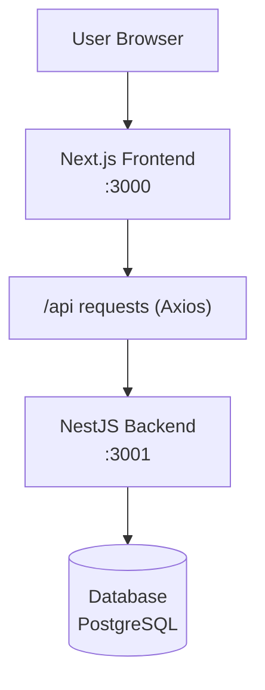

# SECOMPP Project - Event Management Platform

A full-stack application built with Next.js and NestJS for managing the SECOMPP (Computing Week) event at UNESP.

## Project Overview

This project is a web application for event management, specifically designed for the SECOMPP event. It allows users to create, read, update, and delete events, as well as sign up and log in using their institutional email.

### Architecture

The application follows a monorepo structure with two main components:

- **Frontend**: Next.js application with React, TypeScript, and Tailwind CSS
- **Backend**: NestJS API with TypeORM and TypeScript



### Technology Stack

#### Frontend
- Next.js
- React
- TypeScript
- Tailwind CSS

#### Backend
- NestJS
- TypeORM
- TypeScript
- PostgreSQL

#### Additional Tools
- Authentication: JWT, bcrypt
- API Testing: Postman
- Development Tools: ESLint, Prettier, Husky
- Version Control: Git, GitHub

## Getting Started

### Prerequisites

- Node.js (Latest LTS version recommended)
- Yarn package manager
- PostgreSQL database

### Installation

1. Clone the repository:
   ```bash
   git clone https://github.com/Pedro-Alonso/secompp.git
   cd secompp
   ```

2. Install dependencies:
   ```bash
   yarn install
   ```

3. Set up environment variables:
   - Copy `.env.example` to `.env` in the `apps/platform-api` directory
   - Update with your database credentials and other required variables

### Running the Development Server

Run both frontend and backend concurrently:

```bash
yarn dev
```

To run frontend or backend separately:

```bash
# Frontend only (runs on port 3000)
yarn dev:frontend

# Backend only (runs on port 3001)
yarn dev:backend
```

## Project Structure

```
secompp/
├── apps/
│   ├── platform-api/     # NestJS backend
│   │   ├── src/
│   │   │   ├── modules/
│   │   │   ├── entities/
│   │   │   ├── services/
│   │   │   ├── controllers/
│   │   │   └── utils/
│   │   └── ...
│   └── platform-ui/      # Next.js frontend
│       ├── src/
│       │   ├── app/
│       │   ├── components/
│       │   └── utils/
│       └── ...
├── README.md
└── package.json
```

## Development Notes

This project is designed to be an MVP (Minimum Viable Product) for the Databases II course practical project. Further enhancements and features may be added post-course, such as authentication via institutional email and admin dashboards.

### Current Limitations

- Authentication via institutional email may not be fully implemented in the MVP
- Admin dashboard for event management might be basic in the initial version
- Database operations use TypeORM for development speed, rather than raw SQL queries

## License

This project is licensed under the MIT License - see the LICENSE file for details.