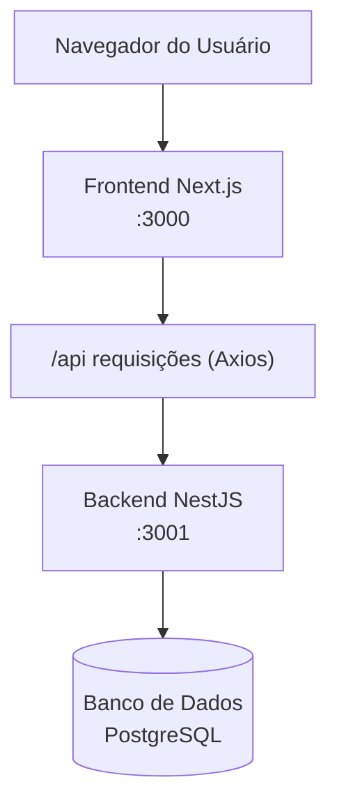

# Projeto SECOMPP - Plataforma de Gerenciamento de Eventos

Uma aplicação full-stack construída com Next.js e NestJS para gerenciar o evento SECOMPP (Semana da Computação) na UNESP.

## Visão Geral do Projeto

Este projeto é uma aplicação web para gerenciamento de eventos, especificamente projetada para o evento SECOMPP. Ele permite que os usuários criem, leiam, atualizem e excluam eventos, além de se cadastrarem e fazerem login usando seu e-mail institucional.

### Arquitetura

A aplicação segue uma estrutura de monorepo com dois componentes principais:

- **Frontend**: Aplicação Next.js com React, TypeScript e Tailwind CSS
- **Backend**: API NestJS com TypeORM e TypeScript



### Stack Tecnológica

#### Frontend
- Next.js
- React
- TypeScript
- Tailwind CSS

#### Backend
- NestJS
- TypeORM
- TypeScript
- PostgreSQL

#### Ferramentas Adicionais
- Autenticação: JWT, bcrypt
- Testes de API: Postman
- Ferramentas de Desenvolvimento: ESLint, Prettier, Husky
- Controle de Versão: Git, GitHub

## Começando

### Pré-requisitos

- Node.js (Recomendada a versão LTS mais recente)
- Gerenciador de pacotes Yarn
- Banco de dados PostgreSQL

### Instalação

1. Clone o repositório:
   ```bash
   git clone https://github.com/Pedro-Alonso/secompp.git
   cd secompp
   ```

2. Instale as dependências:
   ```bash
   yarn install
   ```

3. Configure as variáveis de ambiente:
   - Copie `.env.example` para `.env` no diretório `apps/platform-api`
   - Atualize com suas credenciais de banco de dados e outras variáveis necessárias

### Executando o Servidor de Desenvolvimento

Execute o frontend e o backend simultaneamente:

```bash
yarn dev
```

Para executar o frontend ou o backend separadamente:

```bash
# Apenas frontend (executa na porta 3000)
yarn dev:frontend

# Apenas backend (executa na porta 3001)
yarn dev:backend
```

## Estrutura do Projeto

```
secompp/
├── apps/
│   ├── platform-api/     # Backend NestJS
│   │   ├── src/
│   │   │   ├── modules/
│   │   │   ├── entities/
│   │   │   ├── services/
│   │   │   ├── controllers/
│   │   │   └── utils/
│   │   └── ...
│   └── platform-ui/      # Frontend Next.js
│       ├── src/
│       │   ├── app/
│       │   ├── components/
│       │   └── utils/
│       └── ...
├── README.md
└── package.json
```

## Notas de Desenvolvimento

Este projeto foi projetado para ser um MVP (Produto Mínimo Viável) para o projeto prático do curso de Banco de Dados II. Aprimoramentos e recursos adicionais podem ser adicionados após o curso, como autenticação via e-mail institucional e painéis de administração.

### Limitações Atuais

- A autenticação via e-mail institucional pode não estar totalmente implementada no MVP
- O painel administrativo para gerenciamento de eventos pode ser básico na versão inicial
- As operações de banco de dados utilizam TypeORM para maior velocidade de desenvolvimento, em vez de consultas SQL puras

## Licença

Este projeto está licenciado sob a Licença MIT - veja o arquivo LICENSE para detalhes.